# DHIS2 Wordpress Plugin
A WordPress Guttenberg block plugin for displaying DHIS2 dashboards into a WordPress webpage.

# Software Manual
## DHIS2 Analytics
Edition: January 2020
Version: 1.0.6

DHIS2 Analytics is a WordPress Guttenberg Block plugin developed by Stephocay Limited with financial support from Catholic Relief Services (CRS) through LogoicalOutcomes. The plugin is developed to display DHIS2 dashboards within a WordPress page.  Without the support from CRS and technical guidance by LogicalOutcomes, this project would have been made possible. On behalf of the project team, I would like to thank and pass a vote of thanks to all that have contributed to this first version of the plugin and hopefully develop a community to support its usage beyond its current state. Thanks to the dedicated software developers for making this project a success.

## Chapter 1. Introduction
### 1.1 Background

Welcome to DHIS2 Analytics, your ultimate WordPress Guttenberg block plugin for displaying DHIS2 dashboards in a WordPress powered website.
DHIS2 Analytics is developed to extend the functionality of a WordPress website to display DHIS2 dashboards by providing:
* Simplified and intuitive user interface without the need to do programming (No programming skills required)
* Providing configurable interface for selecting the right dashboard item
* Provision of dynamic DHIS2 based contents as configured in the WordPress editor block settings.
* Support the default WordPress Guttenberg Editor that is shipped with latest version of WordPress.
* Provide end users with diverse options to display DHIS2 contents as desired by the content managers.

The DHIS2 Analytics plugin has been made to support all major latest DHIS2 versions and was tested from DHIS2 2.29 and above.
If you are new to WordPress, refer to [Getting Started with WordPress](https://wordpress.org/support/article/new_to_wordpress_-_where_to_start/) Getting Started with WordPress. Setup and configuration of WordPress is beyond the scope of this manual.
This document provides you with simplified steps and guidance on installing, configuring and using the plugin within your WordPress powered website.

## 2. Getting Started
This section will guide you through the process of installing, activating and configuring the DHIS2 analytics plugin into your existing WordPress powered website. The section has been divided into subsection to give you a concise note on the various requirements required to setup a successful DHIS2 Analytics block plugin on your WordPress website.

### 2.1 Software Requirement

Before installing DHIS2 Analytics  Plugin within your WordPress Powered website, ensure that the following minimum requirements are met. Please note that DHIS2 Analytics has been tested on versions highligted below. While the plugin has been built to support generic DHIS2 implementation, we can not gurantee the future versions after DHIS2 2.33

Software | Minimum Requirements
-------- | --------------------
WordPress |
Version 5.0 + | 1. Disk Space: 1GB+   2. Web Server: Apache or Nginx   3. Database: MySQL version 5.0.15 or greater or any version of MariaDB.   4. RAM: 512MB+   5. PHP: Version 7.3 or greater.   6. Processor: 1.0GHz+
DHIS2 Software | * Minimum Version:  2.29 +   * Maxmium Version: 2.33   NB: Later versions after 2.33 have not been tested yet
Web Browser | * Latest versions of Web browsers.   	* Google Chrome    	* Firefox    	* Opera    	* Edge, etc.

### **2.2 Installation**
To install DHIS2 Analytics Plugin, first obtain the latest stable realese versions from either Github repository or WordPress Plugin repository.
Github
Download the latest version from Github repository below
 [https://github.com/Stephocay-Limited/wp-dhis2-analytics/releases/download/1.0.10/dhis_analytics_1.0.10.zip](https://github.com/Stephocay-Limited/wp-dhis2-analytics/releases/download/1.0.10/dhis_analytics_1.0.10.zip)  

WordPress Plugin repository

Details to be added once it is successfully uploaded into the Wordpress plugin repository.
Using either options, Go to Plugins management panel:

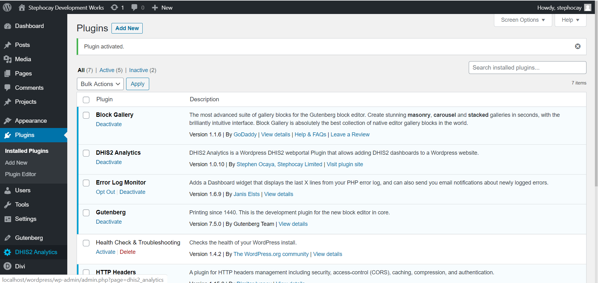

Select the option Add New  to add DHIS2 Analytics plugin. You should be able to see the screen below. Here you can decide to upload a zipped file (e.g. wp-dhis-analytics-1.0.10.zip) downloaded from  [Github](https://github.com/Stephocay-Limited/wp-dhis2-analytics/releases/download/1.0.10/dhis_analytics_1.0.10.zip).

You will also be able to search for the plugin directly from WordPress online Wordpress repository by typing DHIS2 Analytics in 2 below. Once found, click Install Now Button as in 3. After search, your plugin will be as shown in 3.
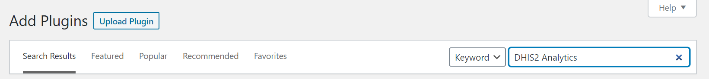

#### Uploading and installing

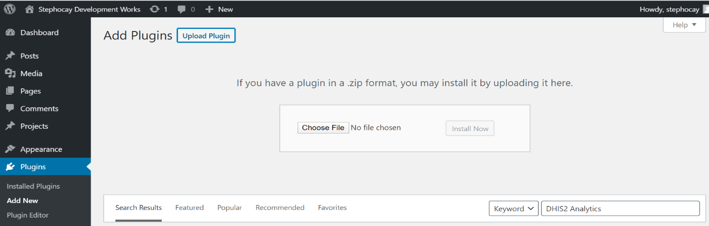

Choose the plugin file from your local storage and Click Install Now as below

Searching directly from WordPress repository
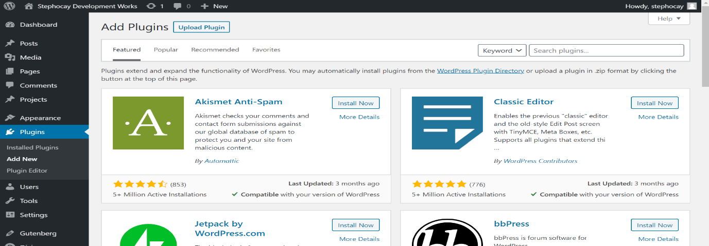

### 2.4 Activating the Plugin
After installing the Plugin using either approach, Activate your Plugin to prepare it for use. Activating DHIS2 Analytics will allow you to proceed to the next step of Configurations.

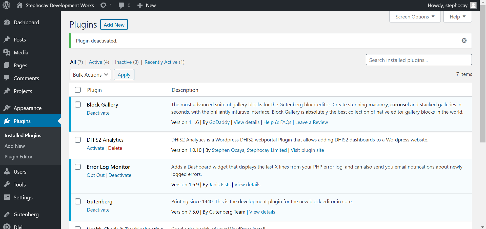

Click on Activate below the DHIS2 Analytics Plugin. Once done, you should see the plugin status as below and also note that on the left panel, a new setting options called DHIS2 Analytics is displayed as below:

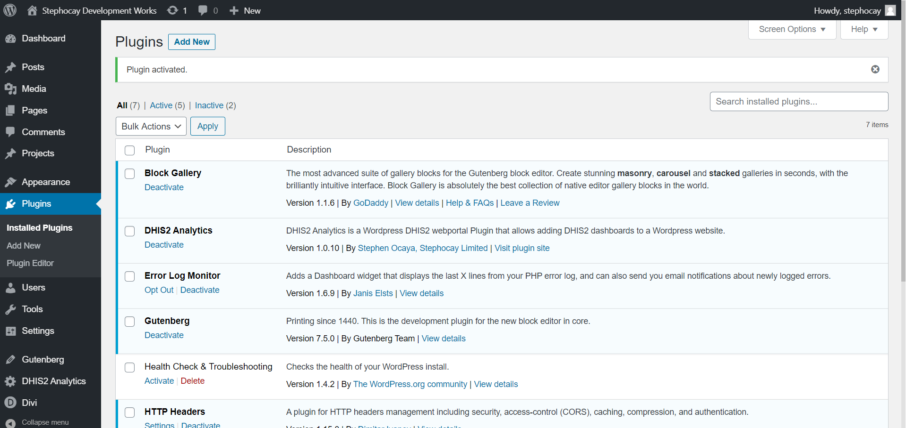

### **2.3 Configurations**
When activated, DHIS2 Analytics plugin creates a settings option page that requires you to set basic details required for it to run. On the left panel as shown, click on DHIS2 Analytics (highlighted in red) to open the page.

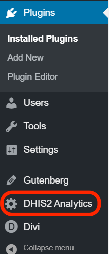

Your page will be open as shown below:

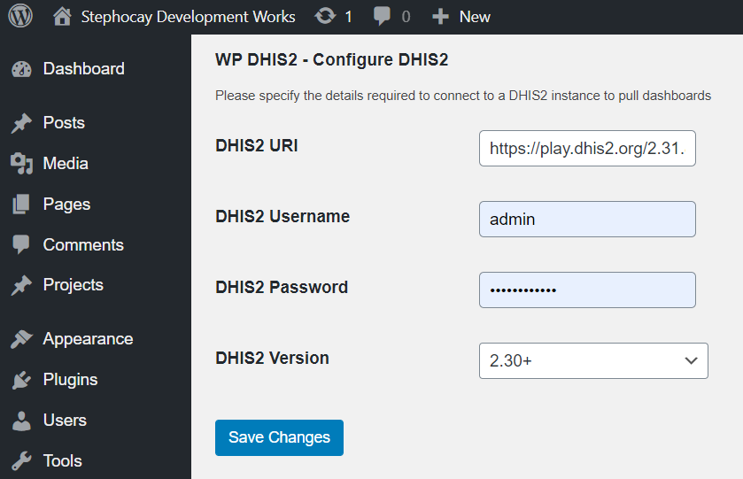

The Basic information required are the details for the DHIS2 instance that you want to integrate with the WordPress through the plugin. Currently we support only one instance of DHIS2. Once done with adding the details, don't forget to click Save Changes.

Required item | Description
------------- | -----------
DHIS2 URI | This is the url address of the DHIS2 instances. Must be a valid URL
DHIS2 Username | This is an existing username in DHIS2 with basic access to dashboards and dashboard items
DHIS2 Password | This is the password for the above username.
DHIS2 Version | For compatibility with lower version 2.29 and below, we require you to specify the DHIS2 version. Either 2.29 or 2.30+

Note: Always create a separate username / password for your DHIS2 instance that will only have access to reports. Do not use the Admin username / password.

### 2.5 Uninstalling
To remove the DHIS2 Analytics plugin from your wordpress website, go to Plugins page and first deactivate the Plugin. Once deactivated, you will be able to see Delete option to the plugin.

 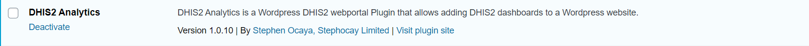

Now, you can delete the plugin or you may change your mind and activate it again as below.

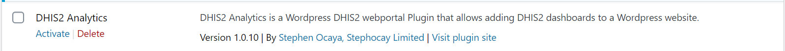

If you have direct access to the Server backend, you can also delete the plugin directly from the plugin directory within Wordpress root directory
WORDPRESS_ROOT_DIRECTORY/wp-content/plugins/wp-dhis_analytics_1.0.10

## 3. DHIS2 Analytics Blocks
 A Block is a a piece of content that can be inserted on a WordPress post or page. WordPress 5.0 + comes with an inbuilt Guttenberg Block Editors that supports adding a block into a page or post using a simplified user interface. The DHIS2 Analytics plugin is a custom Wordpress Guttenberg block developed to display DHIS2 dashboards.  In this guide, we’re going to introduce the Gutenberg DHIS2 Analytics blocks system and show you how to use it

### 3.1 Adding a block to your post or page
To Add a DHIS2 Analytics block on your WordPress post or page, identify the section within your new or existing post or page that you need to display DHIS2 dashboards and decide whether to display the contents as single item, slideshow or grid. Follow the steps below to add a block.
To add any Guttenberg block, within your block editor, look for the  icon on top of the page or by hovering your mouse within the section that you need to add the block.
At the top of the post or page, the first  icon on the left:

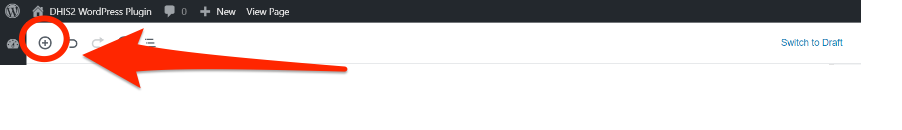

Within your post or page, hover your mouse in the section that you need to add the block, and click the plus icon there.

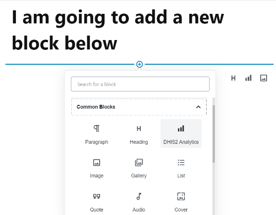

Within the page, you can also see the most recently used block icons.
All Guttenberg blocks are accessible through this approach and are grouped into most used, common blocks, formatting, layout elements, widgets, embeds and ultimate blocks. DHIS2 analytics can be found in the Common Blocks Category.

Select the DHIS2 Analytics Block to add in your post or page.
DHIS2 Analytics Block will connect to DHIS2 instance configured and pull all the available dashboards. Each dashboard has dashboard items that you can select to display in your post.

When done, have added a DHIS2 Analytics Block on your post or page. You should be able to see the following DHIS2 block.

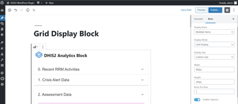

## 3.2 Configure your block
To be able to display the contents now on the front end page, you will need to configure your new DHIS2 Analytics block. This section will guide you through how to configure the block.

### 3.2.1 Identifying display items
The DHIS2 Analytics plugin now support DHIS2 analytics objects below:

Maps | Charts | Report Tables | Text | Resources | Unsupported
---- | ------ | ------------- | ---- | --------- | -----------
 |  |  |  |  | 

NOTES:
* Maps requires height to be set in px. We have defaulted the height to 440px. If you need custom height, specify in px e.g. 300px.
* Resources links requires authentication for in this version as it points to DHIS2 instance. If already logged in to the DHIS2, the resources should work automatically.
* Any item that has the Unsupported icon will not be displayed on the page or post if selected.

### 3.2.2 Display Settings
By default, the DHIS2 Analytics block is set to single item display. This will allow you only to select one dashboard item from all the dashboards available. In all cases, you can set the display size for the block, by default, it is in Full size  or you can select Custom Size and specify the width and height in Pixels (px).

#### Single Item Display
Single Item Display allows you to select only one item at a time. On the right pane, the block settings available for single item display are: _Display Items, Display Size and Enable Caption_

You can switch to Multiple Items to change from Single Item Display and this will allow you to select many items.

Display Size allows you to specify a custom size instead of the default Full Size. If you select Custom size, you will be required to specify Width and Height in pixels as below.

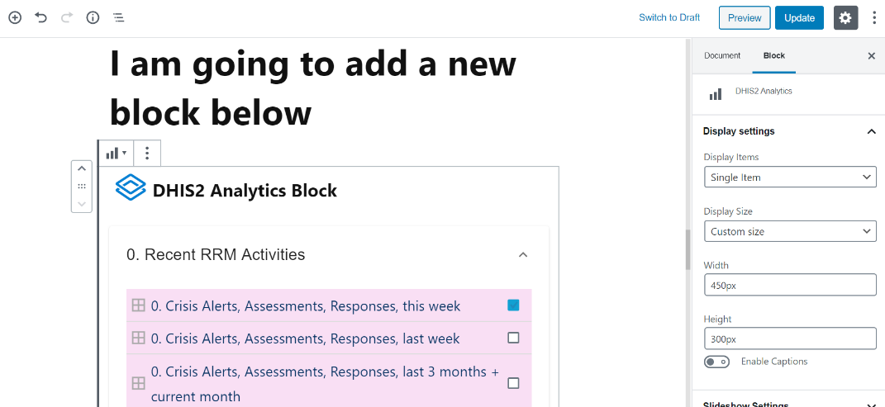

Note:
When providing a value, please remember to add the px characters in the end. .
For example: 450px and 300px   
Other supported units include %, vw (widths), vh (heights)

### Multiple Items Display
DHIS2 Analytics also supports multiple item display. When selected, two display modes Grid and Slideshow displays are provided.

#### Grid Display
  Grid Display allows you to display selected dashboard items in a grid. You can specify the number of items per row defaulted to 2.  Additionally you specify the custom size by indicating the width and height in pixel.

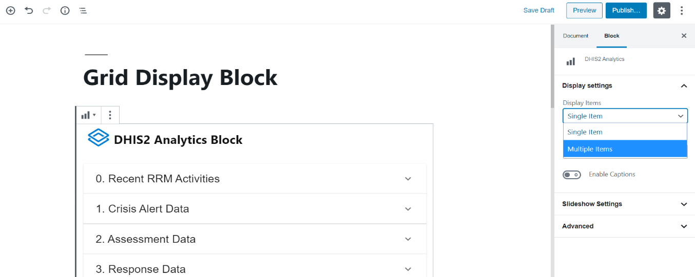

#### How to create Grid block
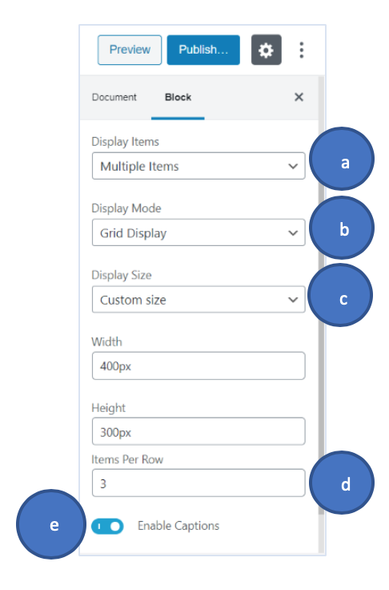
1. On the Block Options,
	* a. Under Display Items, select Multiple Items
	* b. Select Grid Display under Display Mode
	* c. Optionally set Display Size (default to Full Size). If set to Custom, Specify the width and heights
	* d. Optionally Set Items per row (default to 2). You can change it to any positive number depending on the space available.
	* e. Optionally enable caption to display names of the items as set from DHIS2

2. Select the Dashboard Items that you need to display from the available list of dashboards displayed. You can select all the supported item types and mix them as possible.
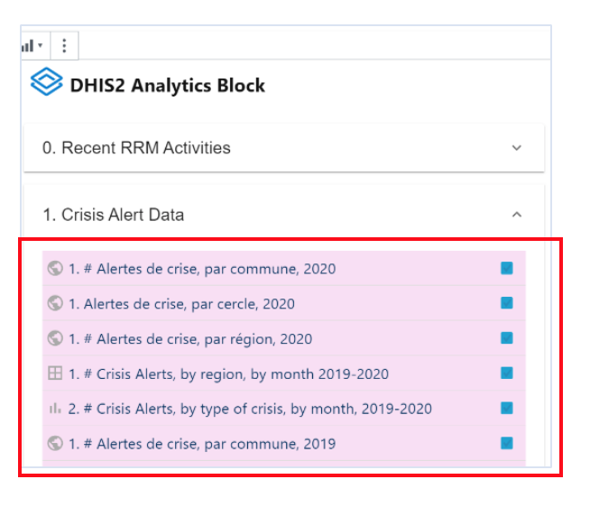

3. Publish or Save your post or page to save the block as in 3.4
4. Preview or View your post or page.

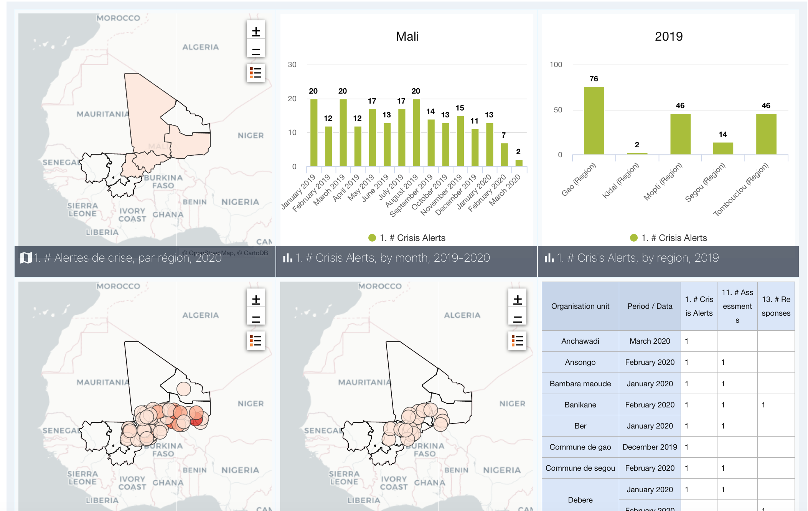

#### **Slideshow Display**
  DHIS2 Analytics also supports slideshow display of of selected dashboard items.  Under display modes, you select Slideshow and optionally leave the rest of the attributes to default. The difference with other displays, Slideshow only allows configuring the height if Custom Size is selected.
  The steps of creating slideshow displays using DHIS2 Analytics is not different from the Grid Display Option except that for Custom Size, you are ONLY required to specify the height in pixel.

 #### **How to create Slideshow block**
1. On the Block Option,
	a. Select Multiple Items under Display Items
	b. Next set Display Mode to Slideshow Display
	c. Then you can Optionally set Display Size. Note that if Custom Size is Selected, you will be only required to Specify Height in Pixel.
	d. Optionally Enable Caption to display Item names below each item
	e. Then finally, There is a new section (Slideshow Settings), Under this Specify the duration in miliseconds for the contents to remain on screens. Default is 1 Minute (60000ms). Refer to the form below

2. Select the Dashboard Items that you need to display from the available list of dashboards displayed. You can select all the supported item types and mix them as possible.

3. Publish or Save your post or page to save the block as in 3.4
4. Preview or View your post or page.

### **3.4 Saving and Updating your block**
 To save your block, you will be required to publish or update your post or page if it is new or existing respectively. Once published or updated, you can preview the post or page to see how the new block will display on the frontend page.

### **3.5 Previewing your block**
 To Preview your post or page, click on the Preview button as shown below
### **3.6 Removing your block**
   Sometimes, you might want to remove your created DHIS2 Analytics block from your post or page. To achieve this, click on the Block, and click on the block More Options  icon.

Plot 7, Charles Lukwiya Road, Kigumba
Kiryandongo, Uganda
Tel: +256 393 217 892
Email:  [info@stephocay.com](mailto:info@stephocay.com)
Website:  [stephocay.com](https://stephocay.com)  
